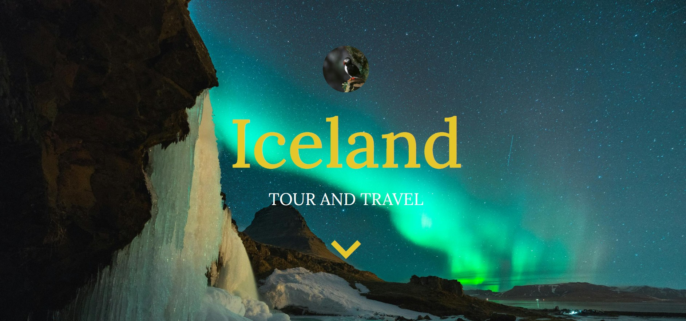
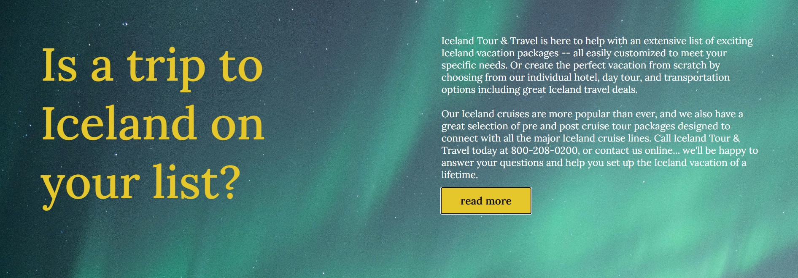
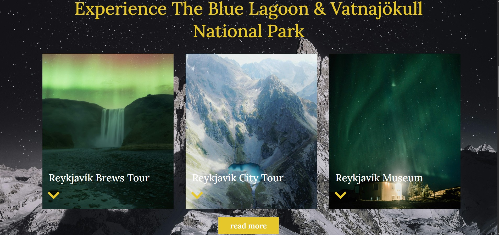
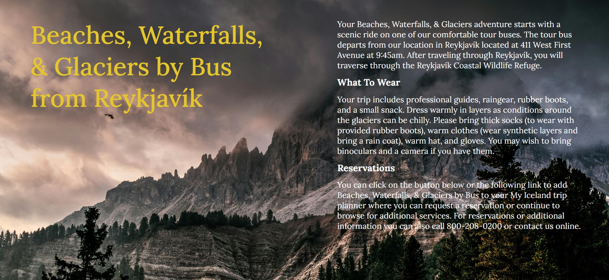
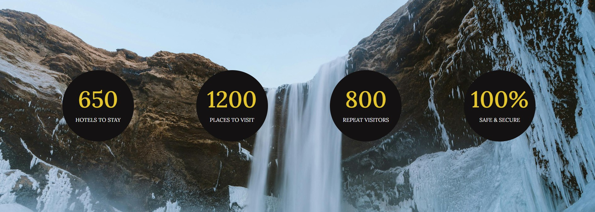
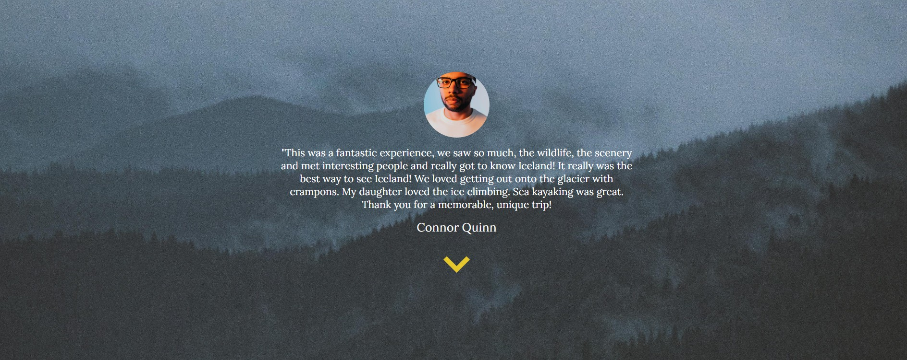
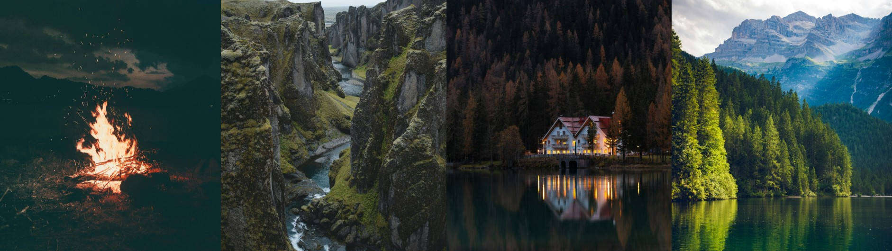

# Travel Blog Website

This website provides an overview of what a tour of Iceland could entail with the company Iceland Tour & Travel. The site has 8 different sections: hero, intro, activities, recommendations, stats, reviews, gallery, and footer. This project was created with:
- HTML
- CSS

The hero section shows the company name.

---
The intro section describes different tour options and contact information.

---
The activities section shows 3 cards of different Iceland activities, including a brews tour, city tour, and museum tour.

---
The recommendations section details one excursion option and how you can reserve it.

---
The stats section gives different statistics about the company.

---
The review section shows one review of someone who booked their trip through this company and their experience.

---
The gallery section shows 4 photos of Iceland.

---
The footer provides contact information and a contact form.

